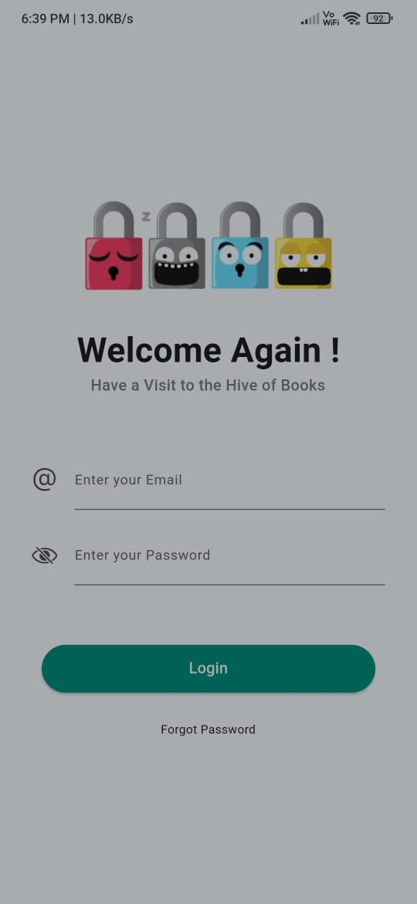
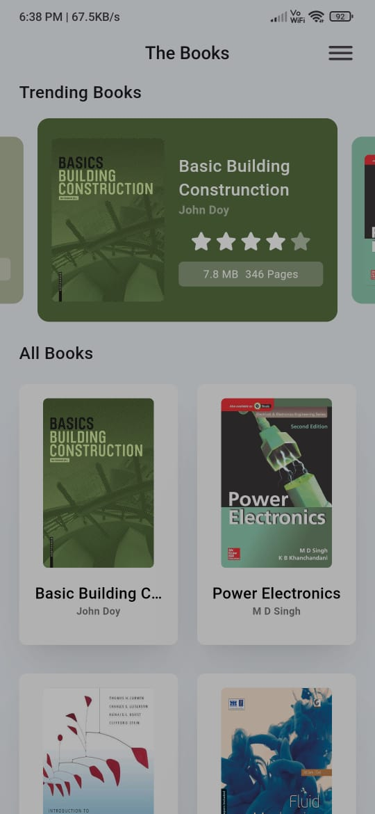
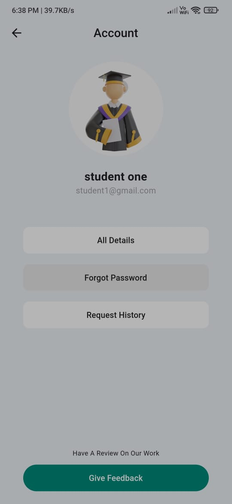
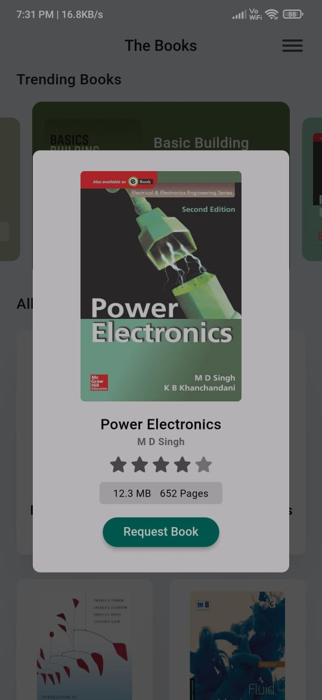
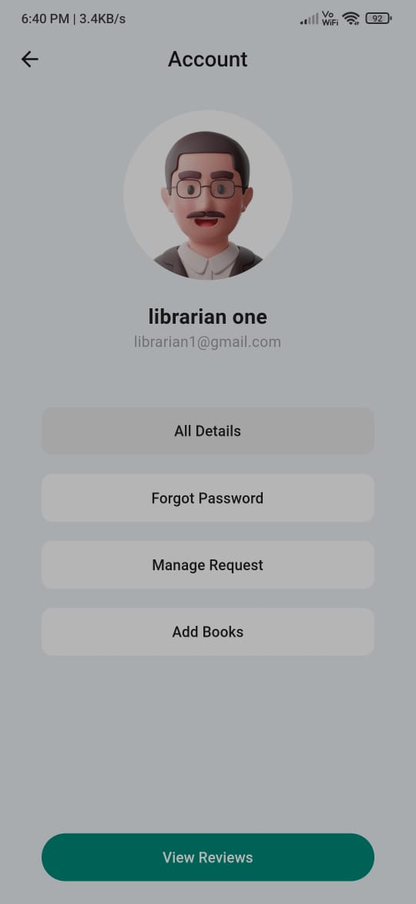
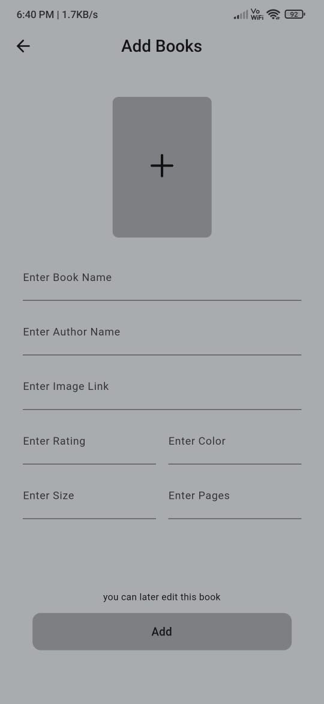
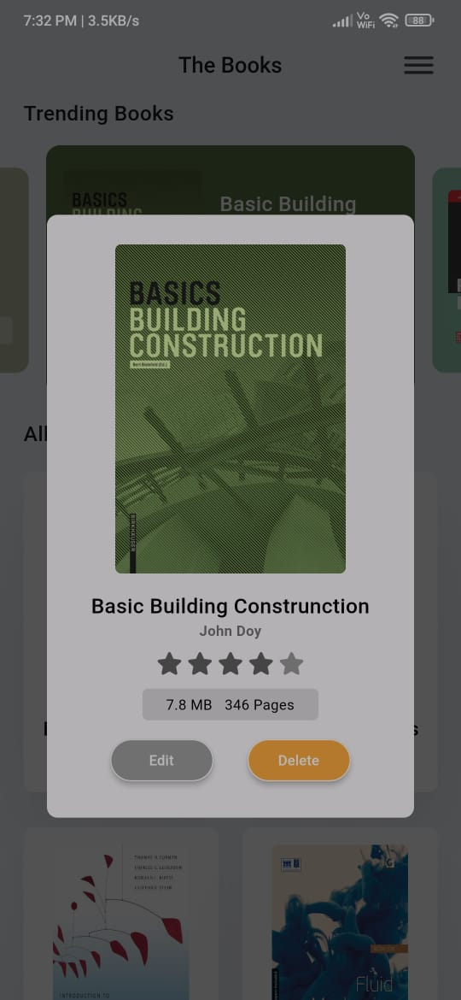
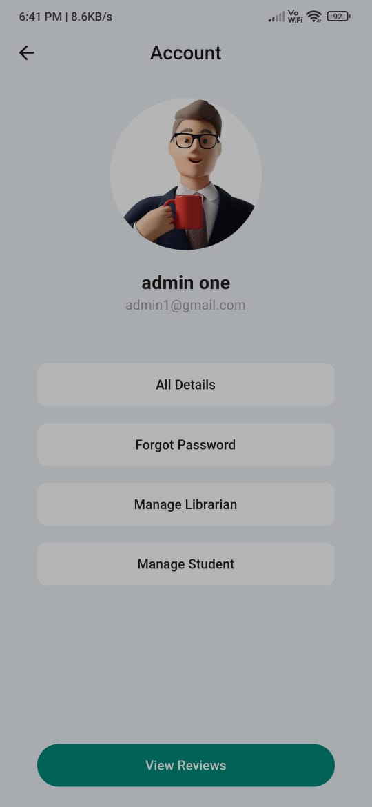
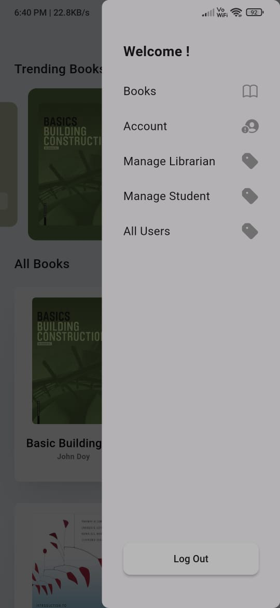

# BookHive

A flutter project for our college library. . .

> link - https://github.com/unstoppable-tanmay/BookHive/tree/main/release/app-arm64-v8a-release.apk

> link - https://github.com/unstoppable-tanmay/BookHive/tree/main/release/app-arm64-v8a-release.apk

## Project Details

## Login details - user can login by the details created and mailed to him by the college - mail and password are hardcoded firstly then they can change this

|            Login             |            Books             |
| :--------------------------: | :--------------------------: |
|  |  |

## User - user means students they can search books and can request books, extend books lease time and request return

|          Student Account          |          Student Request           |
| :----------------------------: | :-----------------------------: |
|  |  |
|  |  |

## Librarian - Librarian can accept request add books etc

|      Librarian Account      |        Accept Request        |
| :-------------------------: | :--------------------------: |
|  |   |
|          Add books          |         update books         |
|   |  |

## Admin - Admin can add student, librarian, and manage book detaild and accound details

|         Admin Account         |         Admin Pannel         |
| :---------------------------: | :--------------------------: |
|  |  |
